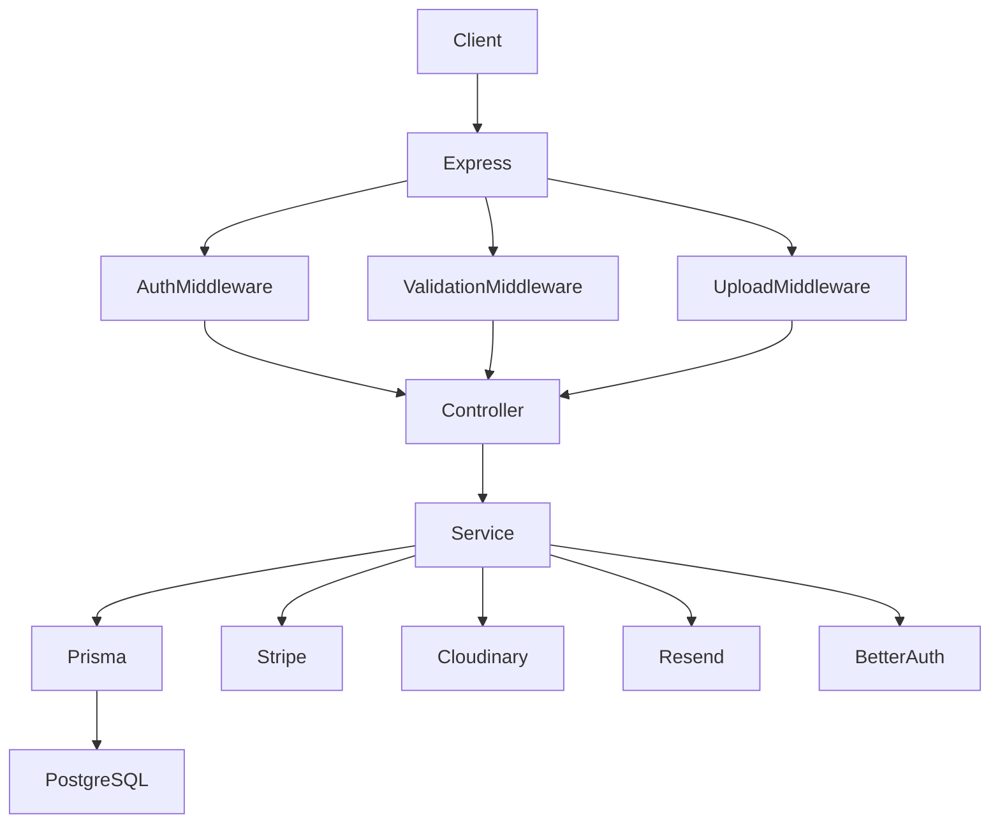
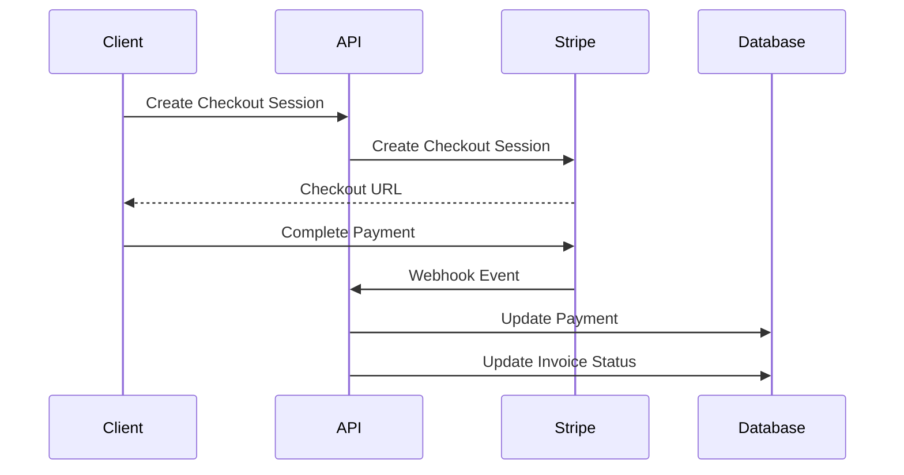

# 🚀 Nexivo AI Backend

**Nexivo AI Backend** is a scalable, enterprise-grade backend API for an **AI Agency SaaS Platform**. It provides complete agency management including authentication, lead management, client and project management, AI conversations, proposal generation, workflow automation, invoicing, Stripe payments, notifications, portfolio management, API key integration, and activity logging.

Built with **Express 5, TypeScript, Prisma 7, PostgreSQL, Better Auth, Zod, Stripe, Cloudinary, and Resend**, the backend follows a clean modular architecture designed for maintainability and scalability.

---

# 📌 Features

## 🔐 Authentication & Authorization

* Email & Password authentication with Better Auth
* Role-based access control
* User session management
* Admin, Team Member, Client, and User roles
* Two-factor authentication schema support
* Secure account management
* User activation and role management

## 👥 User Management

* Get authenticated user profile
* Get all users with pagination
* Get user by ID
* Update user role
* Activate or deactivate users
* Admin-controlled user management

## 🔑 API Key Management

* Create API keys
* View all API keys
* Revoke API keys
* Secure hashed API key storage
* Prefix-based API identification
* Integration-ready service authentication

## 🏢 Agency Management

* Create services
* Update services
* Delete services
* Public service browsing
* Service packages
* Package pricing and features
* Portfolio management
* Portfolio image management
* Technology management
* Testimonials
* Site settings

## 📩 Lead Management

* Public contact form
* Public quote form
* Lead creation
* Lead assignment
* Lead status management
* Lead conversion to client
* Meeting scheduling support
* Budget and source tracking

## 📰 Newsletter

* Newsletter subscription
* Newsletter unsubscription
* Subscriber management
* Active subscriber listing

## 🤝 Client Management

* Create clients
* Convert leads into clients
* Update client information
* Client listing with pagination
* Soft delete support

## 📁 Project Management

* Create projects
* Update projects
* Delete projects
* Project members
* Milestones
* Timeline updates
* Project files
* File categorization
* Client-project relationship

## 🤖 AI Module

* AI conversations
* Conversation messages
* AI proposal generation
* Proposal status management
* Proposal acceptance
* AI usage logging
* Workflow automation execution
* Automation history

## 💰 Billing & Payments

* Invoice creation
* Invoice status management
* Stripe Checkout Session
* Payment records
* Payment history
* Stripe webhook support
* Refund-ready payment structure

## 🔔 Notifications

* Personal notifications
* Unread notification count
* Mark notification as read
* Mark all notifications as read

## 📊 Activity Logs

* User activity tracking
* Entity audit logs
* Admin and Team monitoring
* QueryBuilder pagination support

---

# 🛠 Tech Stack

| Technology   | Usage                 |
| ------------ | --------------------- |
| Node.js      | Runtime               |
| Express.js 5 | Backend Framework     |
| TypeScript   | Programming Language  |
| PostgreSQL   | Database              |
| Prisma 7     | ORM                   |
| Better Auth  | Authentication        |
| Zod 4        | Request Validation    |
| Stripe       | Payment Gateway       |
| Cloudinary   | File Storage          |
| Multer       | File Upload           |
| Resend       | Email Service         |
| Helmet       | Security Headers      |
| CORS         | Cross-Origin Security |
| Rate Limit   | API Protection        |
| tsx          | Development Runtime   |
| tsup         | Production Build      |

---

# 📁 Project Architecture

```text
nexivo-ai-backend/
│
├── prisma/
│   ├── schema.prisma
│   ├── seed.ts
│   └── migrations/
│
├── generated/
│   └── prisma/
│
├── src/
│   ├── app/
│   │   ├── config/
│   │   ├── errors/
│   │   ├── middlewares/
│   │   ├── modules/
│   │   │   ├── auth/
│   │   │   ├── user/
│   │   │   ├── apiKey/
│   │   │   ├── service/
│   │   │   ├── technology/
│   │   │   ├── portfolio/
│   │   │   ├── testimonial/
│   │   │   ├── siteSetting/
│   │   │   ├── newsletter/
│   │   │   ├── lead/
│   │   │   ├── client/
│   │   │   ├── project/
│   │   │   ├── invoice/
│   │   │   ├── payment/
│   │   │   ├── ai/
│   │   │   ├── notification/
│   │   │   └── activityLog/
│   │   │
│   │   ├── routes/
│   │   └── utils/
│   │
│   ├── lib/
│   ├── types/
│   ├── app.ts
│   └── server.ts
│
├── package.json
├── tsconfig.json
├── tsup.config.ts
├── prisma.config.ts
└── README.md
```

---

# 🗄 Database Design

The database is designed around eight major domains.

## Authentication

* User
* Session
* Account
* Verification
* TwoFactor

## Agency

* Service
* ServicePackage
* Portfolio
* PortfolioImage
* Technology
* PortfolioTechnology
* SiteSetting
* Testimonial

## Lead Management

* Lead
* NewsletterSubscriber

## Client & Project

* Client
* Project
* ProjectMember
* Milestone
* Timeline
* ProjectFile

## AI Features

* AIConversation
* AIProposal
* AIUsageLog
* AutomationExecution

## System

* Notification
* ActivityLog

## Billing

* Invoice
* Payment
* StripeWebhookEvent

## Integration

* ApiKey

---

# 👤 User Roles

| Role        | Description                |
| ----------- | -------------------------- |
| SUPER_ADMIN | Full system access         |
| ADMIN       | Administrative access      |
| TEAM_MEMBER | Agency team access         |
| CLIENT      | Client portal access       |
| USER        | Default authenticated user |

---

# 🔄 API Architecture Flow



---

# 📡 API Modules

All primary APIs use:

```text
http://localhost:5000/api/v1
```

Authentication uses:

```text
http://localhost:5000/api/auth
```

## 01. Authentication

```text
POST   /sign-up/email
POST   /sign-in/email
GET    /get-session
```

Supports:

* Admin registration
* Team Member registration
* User registration
* Login
* Session retrieval

---

## 02. User Management

```text
GET    /users
GET    /users/me
GET    /users/:id
PATCH  /users/:id/role
PATCH  /users/:id/status
```

---

## 03. API Keys

```text
POST    /api-keys
GET     /api-keys
DELETE  /api-keys/:id
```

---

## 04. Services & Packages

```text
GET     /services
POST    /services
GET     /services/:id
PATCH   /services/:id
DELETE  /services/:id

POST    /services/:id/packages
PATCH   /services/packages/:id
DELETE  /services/packages/:id
```

---

## 05. Technologies

```text
GET     /technologies
POST    /technologies
PATCH   /technologies/:id
DELETE  /technologies/:id
```

---

## 06. Portfolios

```text
GET     /portfolios
POST    /portfolios
GET     /portfolios/:id
PATCH   /portfolios/:id
DELETE  /portfolios/:id

POST    /portfolios/:id/images
DELETE  /portfolios/images/:imageId
```

---

## 07. Testimonials

```text
GET     /testimonials
POST    /testimonials
PATCH   /testimonials/:id
DELETE  /testimonials/:id
```

---

## 08. Site Settings

```text
GET     /site-settings
POST    /site-settings
PATCH   /site-settings/:key
DELETE  /site-settings/:key
```

---

## 09. Newsletter

```text
POST   /newsletter/subscribe
POST   /newsletter/unsubscribe
GET    /newsletter
```

---

## 10. Leads

```text
POST    /leads
GET     /leads
GET     /leads/:id
PATCH   /leads/:id
DELETE  /leads/:id

POST    /leads/:id/convert
```

---

## 11. Clients

```text
POST    /clients
GET     /clients
GET     /clients/:id
PATCH   /clients/:id
DELETE  /clients/:id
```

---

## 12. Projects

```text
POST    /projects
GET     /projects
GET     /projects/:id
PATCH   /projects/:id
DELETE  /projects/:id
```

### Milestones

```text
POST    /projects/:id/milestones
PATCH   /projects/milestones/:id
DELETE  /projects/milestones/:id
```

### Timelines

```text
POST    /projects/:id/timelines
PATCH   /projects/timelines/:id
DELETE  /projects/timelines/:id
```

### Project Files

```text
POST    /projects/:id/files
GET     /projects/:id/files
DELETE  /project-files/:id
```

---

## 13. Invoices

```text
POST    /invoices
GET     /invoices
GET     /invoices/:id
PATCH   /invoices/:id/status
DELETE  /invoices/:id
```

---

## 14. Payments

```text
POST   /payments/create-checkout-session
GET    /payments
GET    /payments/:id
POST   /payments/webhook
```

---

## 15. AI Module

### AI Conversations

```text
POST   /ai/conversations
POST   /ai/conversations/:id/messages
GET    /ai/conversations/:id
GET    /ai/conversations
```

### AI Proposals

```text
POST   /ai/proposals
GET    /ai/proposals
GET    /ai/proposals/:id
PATCH  /ai/proposals/:id/status
POST   /ai/proposals/:id/accept
```

### AI Usage

```text
GET    /ai/usage-logs
```

### Workflow Automation

```text
POST   /ai/automation-executions
GET    /ai/automation-executions
```

---

## 16. Notifications

```text
GET    /notifications
GET    /notifications/unread-count
PATCH  /notifications/:id/read
PATCH  /notifications/read-all
```

---

## 17. Activity Logs

```text
GET    /activity-logs
```

Supports pagination, sorting, and filtering.

---

# ✔ Validation

All incoming requests are validated using **Zod** before reaching controllers.

Example flow:

```text
Client Request

        │

        ▼

Validation Middleware

        │

        ▼

Zod Schema

        │

        ▼

Controller

        │

        ▼

Service
```

The project uses `parseAsync()` for asynchronous schema validation.

---

# 📦 Standard Response Format

## Success Response

```json
{
  "success": true,
  "statusCode": 200,
  "message": "Request completed successfully",
  "data": {}
}
```

## Paginated Response

```json
{
  "success": true,
  "statusCode": 200,
  "message": "Resources retrieved successfully",
  "data": [],
  "meta": {
    "page": 1,
    "limit": 10,
    "total": 100
  }
}
```

## Error Response

```json
{
  "success": false,
  "statusCode": 400,
  "message": "Validation failed",
  "details": []
}
```

---

# 🔎 Pagination

Supported query parameters:

| Parameter | Type     | Default   |
| --------- | -------- | --------- |
| page      | number   | 1         |
| limit     | number   | 10        |
| sortBy    | string   | createdAt |
| sortOrder | asc/desc | desc      |

Example:

```text
GET /users?page=1&limit=10&sortBy=createdAt&sortOrder=desc
```

---

# ⚙ Environment Variables

Create a `.env` file.

```env
NODE_ENV=development
PORT=5000

DATABASE_URL=

CLIENT_URL=http://localhost:3000

BETTER_AUTH_SECRET=
BETTER_AUTH_URL=http://localhost:5000

GOOGLE_CLIENT_ID=

CLOUDINARY_CLOUD_NAME=
CLOUDINARY_API_KEY=
CLOUDINARY_API_SECRET=

STRIPE_SECRET_KEY=
STRIPE_WEBHOOK_SECRET=

RESEND_API_KEY=
EMAIL_FROM=
```

> Never commit your `.env` file to GitHub.

---

# 🚀 Installation

## Clone Repository

```bash
git clone <your-repository-url>
cd nexivo-ai-backend
```

## Install Dependencies

```bash
pnpm install
```

## Generate Prisma Client

```bash
pnpm run generate
```

## Run Migration

```bash
pnpm run migrate
```

## Seed Database

```bash
pnpm run seed
```

## Start Development Server

```bash
pnpm run dev
```

Server will run at:

```text
http://localhost:5000
```

---

# 🧪 Available Scripts

| Command                 | Description                  |
| ----------------------- | ---------------------------- |
| pnpm run dev            | Start development server     |
| pnpm run build          | Build production project     |
| pnpm start              | Start production server      |
| pnpm run generate       | Generate Prisma Client       |
| pnpm run migrate        | Run development migration    |
| pnpm run migrate:deploy | Deploy production migrations |
| pnpm run seed           | Seed database                |
| pnpm run studio         | Open Prisma Studio           |
| pnpm run reset          | Reset database               |
| pnpm run db:setup       | Generate + Migrate + Seed    |

---

# 🧪 Postman Testing

The project includes a complete **Postman Standard Test Suite** covering all backend modules.

Environment variables include:

```text
baseUrl
authUrl

adminToken
teamMemberToken
userToken

capturedUserId
capturedLeadId
capturedClientId
capturedProjectId
capturedMilestoneId
capturedInvoiceId
capturedPaymentId
capturedAiConversationId
capturedAiProposalId
```

Import both:

* Postman Collection
* Postman Environment

Then execute requests module by module.

---

# 🔐 Security

* Better Auth authentication
* Role-based authorization
* Helmet security headers
* CORS protection
* Rate limiting
* Zod request validation
* Secure API key hashing
* Stripe webhook verification
* Soft delete support for business entities
* Activity audit logging

---

# 🤖 AI Capabilities

Nexivo AI provides a dedicated AI infrastructure for agency workflows.

Features include:

* AI conversations
* Message history
* AI proposal generation
* Proposal lifecycle management
* Proposal acceptance workflow
* AI usage tracking
* Token usage logging
* Workflow automation execution tracking

The AI module is designed to integrate with external AI providers while maintaining complete conversation and usage history inside PostgreSQL.

---

# 💳 Stripe Payment Flow



---

# 📂 File Upload Flow

```text
Client

   │

   ▼

multipart/form-data

   │

   ▼

Multer

   │

   ▼

Cloudinary

   │

   ▼

Database stores URL
```

Supported file categories include:

* IMAGE
* DOCUMENT
* VIDEO
* ARCHIVE
* OTHER

---

# 👨‍💻 Author

**Alamin Ahmed**

Full Stack Developer

GitHub: `Alaminahmedariyan`

---

# 📄 License

This project is licensed under the **ISC License**.
