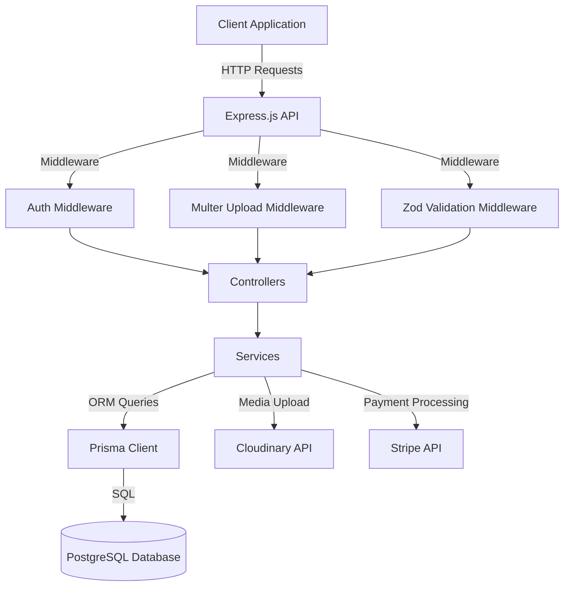
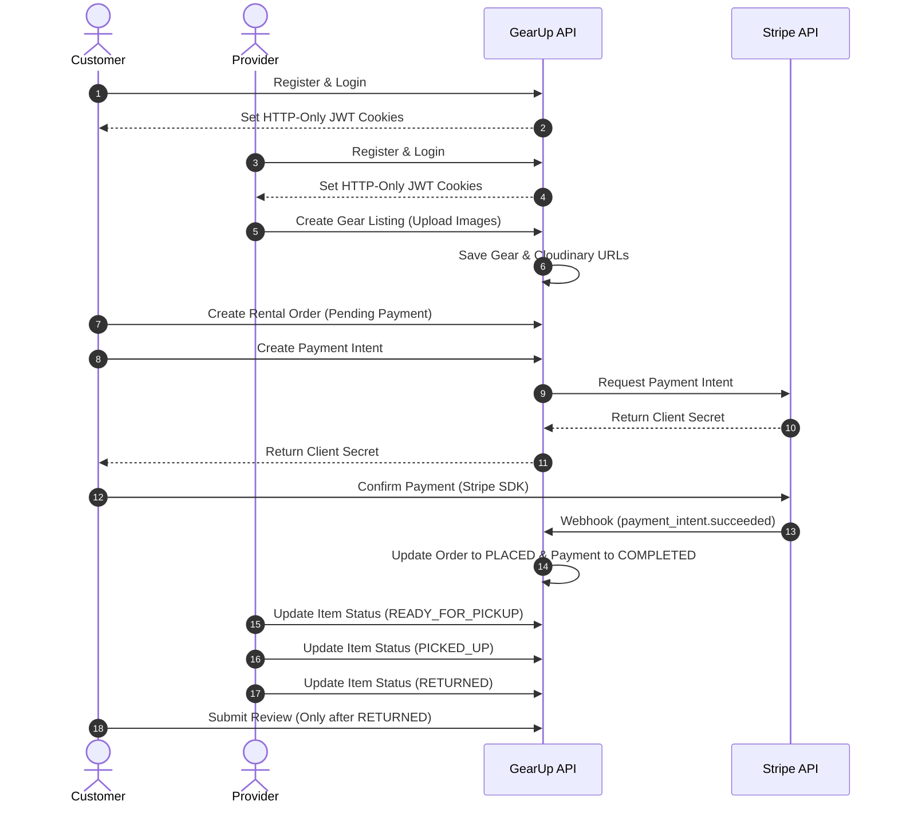

# 🚀 GearUp Backend API

**GearUp** is a robust, enterprise-grade backend API for an outdoor gear rental platform. It enables seamless gear sharing, rental management, secure payments via Stripe, and user reviews. Built with modern technologies, it features role-based access control (RBAC), real-time availability calculations, Google OAuth authentication, password reset via email, image upload to Cloudinary, and automated payment processing via Stripe webhooks.

---

# 🔖 Badges

[](https://nodejs.org/)
[](https://expressjs.com/)
[](https://www.typescriptlang.org/)
[](https://www.postgresql.org/)
[](https://www.prisma.io/)
[](https://jwt.io/)
[](https://stripe.com/)
[](https://cloudinary.com/)
[](https://railway.app/)

---

## 📑 Table of Contents

- [Features](#-features)
- [Tech Stack](#-tech-stack)
- [Project Architecture](#-project-architecture)
- [Folder Structure](#-folder-structure)
- [Database Design](#-database-design)
- [API Flow](#-api-flow)
- [Authentication & Authorization](#-authentication--authorization)
- [API Endpoints](#-api-endpoints)
- [Request/Response Examples](#-requestresponse-examples)
- [Validation](#-validation)
- [Error Response Format](#-error-response-format)
- [Success Response Format](#-success-response-format)
- [Pagination](#-pagination)
- [Environment Variables](#-environment-variables)
- [Installation & Setup](#-installation--setup)
- [Deployment](#-deployment)
- [Stripe Integration](#-stripe-integration)
- [Security](#-security)
- [Author](#-author)
- [License](#-license)

---

## ✨ Features

### Public Features

- **Browse Gear Items**: Filter, search, sort, and paginate all listed gear items.
- **Category Navigation**: Explore gear items organized by hierarchical categories (parent-child).
- **Check Availability**: Real-time date-based availability checks for any gear item.
- **View Reviews**: Read verified customer reviews and ratings for gear items.

### Customer Features

- **Profile Management**: Retrieve and update personal profile details with image upload, change password.
- **Rental Management**: Create rental orders with multiple items, view personal rental history, cancel pending rentals.
- **Payments**: Create Stripe Payment Intents and confirm payments.
- **Reviews**: Submit ratings and comments for returned gear items.

### Provider Features

- **Gear Management**: Create new gear listings with up to 10 images, update gear details, delete listings.
- **Rental Tracking**: View rental requests for owned gear, view single rental details, update item rental statuses (`READY_FOR_PICKUP` → `PICKED_UP` → `RETURNED`).
- **Dashboard**: Access provider-specific analytics (earnings, active rentals, gear stats).
- **Reviews**: View reviews received on owned gear items.

### Admin Features

- **Category Management**: Create, update, and delete hierarchical categories.
- **User Management**: View all users, suspend or activate user accounts.
- **Gear Moderation**: View all gear items across the platform, moderate gear listings (approve/unlist).
- **Payment Monitoring**: View all payments across the platform.
- **Dashboard**: Access platform-wide analytics (total revenue, user growth, rental volume).

### Authentication & Security Features

- **Email/Password Registration & Login**: Secure authentication with bcryptjs password hashing.
- **Google OAuth Login**: Sign in using Google ID tokens.
- **JWT Access & Refresh Tokens**: HTTP-only cookie-based token management.
- **Rate Limiting**: Login endpoint protected against brute-force attacks.
- **Password Reset Flow**: Forgot password and reset password with email delivery via Resend.
- **Role-Based Access Control (RBAC)**: Granular route protection for `CUSTOMER`, `PROVIDER`, and `ADMIN`.

### Payment Features

- **Stripe Payment Intents**: Secure payment intent creation and confirmation.
- **Stripe Webhook**: Automated, asynchronous payment status updates and order placement.
- **Payment History**: Customers can view their payment history.

---

## 🛠 Tech Stack

- **Runtime**: Node.js
- **Framework**: Express.js (v5.x)
- **Language**: TypeScript (v6.x)
- **Database**: PostgreSQL (via Neon)
- **ORM**: Prisma (v7.x) with `@prisma/adapter-pg`
- **Authentication**: JSON Web Tokens (JWT), bcryptjs, Google Auth Library
- **Payment Gateway**: Stripe API
- **Cloud Storage**: Cloudinary with Multer & `multer-storage-cloudinary`
- **Validation**: Zod (v4.x)
- **Email**: Resend
- **Deployment**: Railway
- **Build Tool**: tsup

---

## 🏗 Project Architecture



---

## 📂 Folder Structure

```
prisma-gearup-backend/
├── generated/                  # Generated Prisma Client
├── prisma/
│   ├── migrations/             # Database migrations
│   └── schema/                 # Modular Prisma schema files
│       ├── category.prisma
│       ├── enums.prisma
│       ├── gearImage.prisma
│       ├── gearItem.prisma
│       ├── payment.prisma
│       ├── rentalOrder.prisma
│       ├── rentalOrderItem.prisma
│       ├── review.prisma
│       ├── schema.prisma
│       └── user.prisma
├── src/
│   ├── app.ts                  # Express application setup
│   ├── server.ts               # Server entry point
│   ├── app/
│   │   ├── config/             # Configuration files (Cloudinary, Env)
│   │   ├── errors/             # Custom error classes and handlers
│   │   ├── middlewares/        # Global middlewares (Auth, Multer, Error, Rate Limiter)
│   │   ├── modules/            # Feature modules (MVC/Service pattern)
│   │   │   ├── auth/           # Login, Google OAuth, Refresh Token, Logout, Forgot/Reset Password
│   │   │   ├── category/       # CRUD categories (Admin only for mutations)
│   │   │   ├── dashboard/      # Admin, Provider, Customer dashboards
│   │   │   ├── gear/           # CRUD gear items, availability check, moderation
│   │   │   ├── payment/        # Stripe intents, confirmations, webhooks
│   │   │   ├── rental/         # Rental orders, status management
│   │   │   ├── review/         # Reviews and ratings
│   │   │   └── user/           # Registration, profile, admin user management
│   │   ├── routes/             # Global router aggregator
│   │   └── utils/              # Utility functions (catchAsync, sendResponse, sendEmail)
│   ├── lib/                    # Library initializations (Prisma, JWT)
│   └── types/                  # TypeScript type declarations
├── package.json
├── tsconfig.json
├── tsup.config.ts
├── prisma.config.ts
└── gearup.postman_collection.json
```

---

## 🗃 Database Design

### Models Explanation

- **User**: Represents platform users with roles (`CUSTOMER`, `PROVIDER`, `ADMIN`), statuses (`ACTIVE`, `SUSPENDED`, `VERIFICATION_PENDING`), and auth provider (`LOCAL`, `GOOGLE`). Supports soft-delete via `deletedAt`.
- **Category**: Hierarchical category model supporting parent-child relationships for gear classification.
- **GearItem**: Gear listings owned by a `PROVIDER` and belonging to a `Category`. Supports JSON `specifications` field. Real-time availability is computed dynamically based on rental orders.
- **GearImage**: Stores image URLs hosted on Cloudinary, supporting one primary image per gear item.
- **RentalOrder**: Tracks the overall rental transaction, order status (`PENDING_PAYMENT`, `PLACED`, `CANCELLED`, `COMPLETED`), payment status, and total amount.
- **RentalOrderItem**: Individual gear items within a rental order, tracking rental dates, quantities, price details, security deposit, late fees, and item-level rental statuses (`CONFIRMED`, `READY_FOR_PICKUP`, `PICKED_UP`, `RETURNED`, `OVERDUE`, `DAMAGED`, `CANCELLED`).
- **Payment**: Records payment transactions with Stripe, tracking transaction IDs, amounts, refunds, payment methods, and gateway responses.
- **Review**: Customer reviews and ratings linked to specific returned rental items. One review per rental order item (unique constraint).

### Entity-Relationship (ER) Diagram

```mermaid
erDiagram
    USER {
        String id PK
        String name
        String email UK
        String password "nullable, OAuth users"
        AuthProvider provider
        String phone "nullable"
        String address "nullable"
        String nidUrl "nullable"
        String image "nullable"
        Role role
        UserStatus status
        DateTime deletedAt "nullable"
    }
    CATEGORY {
        String id PK
        String name UK
        String slug UK
        String description "nullable"
        String parentId FK "nullable"
    }
    GEAR_ITEM {
        String id PK
        String name
        String slug UK
        String description
        String brand "nullable"
        Decimal pricePerDay
        Decimal originalPricePerDay "nullable"
        Int totalQuantity
        Json specifications "nullable"
        Boolean isListed
        String providerId FK
        String categoryId FK
        DateTime deletedAt "nullable"
    }
    GEAR_IMAGE {
        String id PK
        String imageUrl
        Boolean isPrimary
        String gearItemId FK
    }
    RENTAL_ORDER {
        String id PK
        String orderNumber UK
        OrderStatus status
        PaymentStatus paymentStatus
        Decimal totalAmount
        String cancellationReason "nullable"
        String customerId FK
    }
    RENTAL_ORDER_ITEM {
        String id PK
        Int quantity
        Decimal pricePerDay
        Decimal subtotal
        Decimal securityDeposit
        DateTime startDate
        DateTime endDate
        DateTime pickedUpAt "nullable"
        DateTime returnedAt "nullable"
        Decimal lateFee
        ItemRentalStatus status
        String rentalOrderId FK
        String gearItemId FK
    }
    PAYMENT {
        String id PK
        String transactionId UK
        Decimal amount
        Decimal refundAmount "nullable"
        PaymentMethod method
        PaymentStatus status
        DateTime paidAt "nullable"
        DateTime refundedAt "nullable"
        Json gatewayResponse "nullable"
        String rentalOrderId FK
    }
    REVIEW {
        String id PK
        Int rating
        String comment "nullable"
        String customerId FK
        String gearItemId FK
        String rentalOrderItemId FK UK
    }

    USER ||--o{ GEAR_ITEM : "lists"
    USER ||--o{ RENTAL_ORDER : "places"
    USER ||--o{ REVIEW : "writes"
    CATEGORY ||--o{ GEAR_ITEM : "classifies"
    CATEGORY ||--o{ CATEGORY : "parent-child"
    GEAR_ITEM ||--o{ GEAR_IMAGE : "has"
    GEAR_ITEM ||--o{ RENTAL_ORDER_ITEM : "rented-as"
    RENTAL_ORDER ||--|{ RENTAL_ORDER_ITEM : "contains"
    RENTAL_ORDER ||--o{ PAYMENT : "has"
    GEAR_ITEM ||--o{ REVIEW : "receives"
    RENTAL_ORDER_ITEM ||--o{ REVIEW : "reviewed-by"
```

### Enums

| Enum               | Values                                                                                      |
| :----------------- | :------------------------------------------------------------------------------------------ |
| `Role`             | `CUSTOMER`, `PROVIDER`, `ADMIN`                                                             |
| `UserStatus`       | `ACTIVE`, `SUSPENDED`, `VERIFICATION_PENDING`                                               |
| `AuthProvider`     | `LOCAL`, `GOOGLE`                                                                           |
| `OrderStatus`      | `PENDING_PAYMENT`, `PLACED`, `CANCELLED`, `COMPLETED`                                       |
| `ItemRentalStatus` | `CONFIRMED`, `READY_FOR_PICKUP`, `PICKED_UP`, `RETURNED`, `OVERDUE`, `DAMAGED`, `CANCELLED` |
| `PaymentMethod`    | `STRIPE`, `SSLCOMMERZ`                                                                      |
| `PaymentStatus`    | `PENDING`, `COMPLETED`, `FAILED`, `REFUNDED`                                                |

---

## 🔄 API Flow



---

## 🔐 Authentication & Authorization

### JWT Flow

1. **Registration/Login**: User submits credentials or Google ID token. On success, the server generates an Access Token and a Refresh Token.
2. **Token Storage**: Both tokens are set as secure, HTTP-only cookies (`accessToken`, `refreshToken`) to prevent XSS attacks.
   - `accessToken`: Expires in 1 day (configurable via `JWT_ACCESS_EXPIRES_IN`).
   - `refreshToken`: Expires in 7 days (configurable via `JWT_REFRESH_EXPIRES_IN`).
3. **Authorization**: The `auth` middleware extracts the token from cookies or the `Authorization: Bearer <token>` header, verifies it, checks user status (not deleted, not suspended), and attaches the user payload (`id`, `email`, `role`) to `req.user`.
4. **Token Refresh**: When the access token expires, the client can call `/api/v1/auth/refresh-token` with the refresh token cookie to get a new access token.
5. **Logout**: Clears both `accessToken` and `refreshToken` cookies.

### Role-Based Access Control (RBAC)

Routes are protected using the `auth(...roles)` middleware. Only users with matching roles can access specific endpoints:

| Role       | Capabilities                                                                                                                                                    |
| :--------- | :-------------------------------------------------------------------------------------------------------------------------------------------------------------- |
| `ADMIN`    | Full platform control: category CRUD, user management (view all, update status), gear moderation (view all, approve/unlist), view all payments, admin dashboard |
| `PROVIDER` | Gear CRUD, view own gear, rental tracking for owned gear, update rental item statuses, provider dashboard, provider reviews                                     |
| `CUSTOMER` | Create rentals, view own rentals, cancel pending rentals, payments (create intent, confirm, view history), submit reviews, customer dashboard                   |

### Password Reset Flow

1. User requests password reset via `POST /api/v1/auth/forgot-password` with their email.
2. Server generates a reset token and sends a password reset email via Resend.
3. User clicks the link and submits `POST /api/v1/auth/reset-password` with the token and new password.

### Rate Limiting

The login endpoints (`/api/v1/auth/login`, `/api/v1/auth/google`) are protected by rate limiting to prevent brute-force attacks.

---

## 📡 API Endpoints

All API endpoints are prefixed with `/api/v1`.

### Health Check

| Method | URL | Description                                            |
| :----- | :-- | :----------------------------------------------------- |
| `GET`  | `/` | Health check — returns "GearUp Rental API is running." |

### Auth Endpoints

| Method | URL                            | Allowed Roles | Description                                     |
| :----- | :----------------------------- | :------------ | :---------------------------------------------- |
| `POST` | `/api/v1/auth/login`           | Public        | Authenticate user with email & password         |
| `POST` | `/api/v1/auth/google`          | Public        | Authenticate user with Google ID token          |
| `POST` | `/api/v1/auth/refresh-token`   | Public        | Refresh access token using refresh token cookie |
| `POST` | `/api/v1/auth/logout`          | Public        | Clear authentication cookies                    |
| `POST` | `/api/v1/auth/forgot-password` | Public        | Request password reset email                    |
| `POST` | `/api/v1/auth/reset-password`  | Public        | Reset password using reset token                |

### User Endpoints

| Method  | URL                             | Allowed Roles                   | Description                                          |
| :------ | :------------------------------ | :------------------------------ | :--------------------------------------------------- |
| `POST`  | `/api/v1/users/register`        | Public                          | Register a new user account                          |
| `GET`   | `/api/v1/users/me`              | `CUSTOMER`, `PROVIDER`, `ADMIN` | Retrieve current user profile                        |
| `PATCH` | `/api/v1/users/me`              | `CUSTOMER`, `PROVIDER`, `ADMIN` | Update current user profile (with image upload)      |
| `PATCH` | `/api/v1/users/change-password` | `CUSTOMER`, `PROVIDER`, `ADMIN` | Change account password                              |
| `GET`   | `/api/v1/users`                 | `ADMIN`                         | Retrieve all users (with pagination, search, filter) |
| `PATCH` | `/api/v1/users/:id/status`      | `ADMIN`                         | Update user status (activate/suspend)                |

### Category Endpoints

| Method   | URL                      | Allowed Roles | Description                |
| :------- | :----------------------- | :------------ | :------------------------- |
| `POST`   | `/api/v1/categories`     | `ADMIN`       | Create a new category      |
| `GET`    | `/api/v1/categories`     | Public        | Retrieve all categories    |
| `GET`    | `/api/v1/categories/:id` | Public        | Retrieve a single category |
| `PATCH`  | `/api/v1/categories/:id` | `ADMIN`       | Update category details    |
| `DELETE` | `/api/v1/categories/:id` | `ADMIN`       | Delete a category          |

### Gear Endpoints

| Method   | URL                              | Allowed Roles | Description                                                            |
| :------- | :------------------------------- | :------------ | :--------------------------------------------------------------------- |
| `GET`    | `/api/v1/gears`                  | Public        | Retrieve all listed gear items (with search, filter, sort, pagination) |
| `GET`    | `/api/v1/gears/:id`              | Public        | Retrieve a single gear item by ID                                      |
| `GET`    | `/api/v1/gears/:id/availability` | Public        | Check real-time availability for specific dates                        |
| `POST`   | `/api/v1/gears`                  | `PROVIDER`    | Create a new gear listing (supports up to 10 images)                   |
| `GET`    | `/api/v1/gears/my-gears`         | `PROVIDER`    | Retrieve provider's own gear listings                                  |
| `PATCH`  | `/api/v1/gears/:id`              | `PROVIDER`    | Update gear listing details (with image upload)                        |
| `DELETE` | `/api/v1/gears/:id`              | `PROVIDER`    | Delete a gear listing                                                  |
| `GET`    | `/api/v1/gears/admin`            | `ADMIN`       | Retrieve all gear items (including unlisted) for admin                 |
| `PATCH`  | `/api/v1/gears/:id/moderate`     | `ADMIN`       | Moderate gear listing (approve/unlist)                                 |

### Rental Endpoints

| Method  | URL                                           | Allowed Roles | Description                                         |
| :------ | :-------------------------------------------- | :------------ | :-------------------------------------------------- |
| `POST`  | `/api/v1/rentals`                             | `CUSTOMER`    | Create a new rental order                           |
| `GET`   | `/api/v1/rentals/my-rentals`                  | `CUSTOMER`    | Retrieve customer's rental history                  |
| `GET`   | `/api/v1/rentals/:id`                         | `CUSTOMER`    | Retrieve a single rental order details              |
| `PATCH` | `/api/v1/rentals/:id/cancel`                  | `CUSTOMER`    | Cancel a pending rental order                       |
| `GET`   | `/api/v1/rentals/provider/rentals`            | `PROVIDER`    | Retrieve rental orders for provider's gear          |
| `GET`   | `/api/v1/rentals/provider/rentals/:id`        | `PROVIDER`    | Retrieve a single rental order details for provider |
| `PATCH` | `/api/v1/rentals/provider/rentals/:id/status` | `PROVIDER`    | Update rental item status                           |

### Payment Endpoints

| Method | URL                        | Allowed Roles | Description                              |
| :----- | :------------------------- | :------------ | :--------------------------------------- |
| `POST` | `/api/v1/payments/create`  | `CUSTOMER`    | Create Stripe Payment Intent             |
| `POST` | `/api/v1/payments/confirm` | `CUSTOMER`    | Confirm payment and update order status  |
| `GET`  | `/api/v1/payments`         | `CUSTOMER`    | Retrieve customer's payment history      |
| `GET`  | `/api/v1/payments/:id`     | `CUSTOMER`    | Retrieve a single payment details        |
| `GET`  | `/api/v1/payments/admin`   | `ADMIN`       | Retrieve all payments (with pagination)  |
| `POST` | `/api/v1/payments/webhook` | Public        | Stripe Webhook endpoint for async events |

### Review Endpoints

| Method | URL                                | Allowed Roles | Description                                   |
| :----- | :--------------------------------- | :------------ | :-------------------------------------------- |
| `POST` | `/api/v1/reviews`                  | `CUSTOMER`    | Submit a review for a returned rental item    |
| `GET`  | `/api/v1/reviews/:gearId`          | Public        | Retrieve all reviews for a specific gear item |
| `GET`  | `/api/v1/reviews/my-reviews`       | `CUSTOMER`    | Retrieve customer's own reviews               |
| `GET`  | `/api/v1/reviews/provider-reviews` | `PROVIDER`    | Retrieve reviews for provider's gear items    |

### Dashboard Endpoints

| Method | URL                          | Allowed Roles | Description                                   |
| :----- | :--------------------------- | :------------ | :-------------------------------------------- |
| `GET`  | `/api/v1/dashboard/admin`    | `ADMIN`       | Retrieve platform-wide admin analytics        |
| `GET`  | `/api/v1/dashboard/provider` | `PROVIDER`    | Retrieve provider earnings and gear analytics |
| `GET`  | `/api/v1/dashboard/customer` | `CUSTOMER`    | Retrieve customer rental statistics           |

---

## ✔ Validation

All incoming request payloads are strictly validated using **Zod** schemas before reaching the controllers. This ensures type safety and clean data entry.

### Auth Validation

```typescript
// Login
z.object({
  email: z.string().email().trim().toLowerCase(),
  password: z.string().min(6),
});

// Google Login
z.object({
  idToken: z.string().min(1),
});

// Forgot Password
z.object({
  email: z.string().email(),
});

// Reset Password
z.object({
  token: z.string(),
  newPassword: z.string().min(6),
});
```

### User Registration Validation

```typescript
z.object({
  name: z.string().trim().min(2).max(100),
  email: z.string().email().trim().toLowerCase(),
  password: z.string().min(6),
  phone: z.string().optional(),
  address: z.string().optional(),
  nidUrl: z.string().url().optional(),
  role: z.enum(["CUSTOMER", "PROVIDER"]).optional(),
  image: z.string().optional(),
});
```

### Category Validation

```typescript
// Create
z.object({
  name: z.string().trim().min(2).max(100),
  description: z.string().trim().max(500).optional(),
  parentId: z.string().trim().nullish(),
});

// Update — partial of create schema
```

### Gear Validation

```typescript
// Create
z.object({
  name: z.string().trim().min(2).max(150),
  description: z.string().trim().min(10),
  brand: z.string().trim().optional(),
  pricePerDay: z.coerce.number().positive(),
  originalPricePerDay: z.number().positive().optional(),
  totalQuantity: z.coerce.number().int().min(1),
  specifications: z.any().optional(),
  categoryId: z.string().trim(),
});

// Update
z.object({
  name: z.string().trim().min(2).max(150).optional(),
  description: z.string().trim().min(10).optional(),
  brand: z.string().trim().optional(),
  pricePerDay: z.coerce.number().positive().optional(),
  totalQuantity: z.coerce.number().int().min(1).optional(),
  specifications: z.any().optional(),
  categoryId: z.string().optional(),
  isListed: z.boolean().optional(),
});
```

### Rental Validation

```typescript
// Create Rental
const rentalItemSchema = z.object({
  gearItemId: z.string().min(1),
  quantity: z.coerce.number().int().positive(),
  startDate: z.string().min(1),
  endDate: z.string().min(1),
});

z.object({
  items: z.array(rentalItemSchema).min(1),
});

// Cancel Rental
z.object({
  cancellationReason: z.string().trim().min(5).max(500),
});

// Update Rental Status
z.object({
  status: z.enum(["READY_FOR_PICKUP", "PICKED_UP", "RETURNED"]),
});
```

### Payment Validation

```typescript
// Create Payment Intent
z.object({
  rentalOrderId: z.string(),
});

// Confirm Payment
z.object({
  paymentIntentId: z.string(),
});
```

### Review Validation

```typescript
z.object({
  rating: z.number().int().min(1).max(5),
  comment: z.string().trim().min(5).max(500).optional(),
  rentalOrderItemId: z.string().min(1),
});
```

### User Profile Update Validation

```typescript
z.object({
  name: z.string().trim().min(2).max(100).optional(),
  phone: z.string().trim().optional(),
  address: z.string().trim().optional(),
  nidUrl: z.string().url().optional(),
  role: z.enum(["CUSTOMER", "PROVIDER"]).optional(),
  image: z.string().optional(),
});

// Change Password
z.object({
  oldPassword: z.string().trim().min(6).max(100),
  newPassword: z.string().trim().min(6).max(100),
});

// Update User Status (Admin)
z.object({
  status: z.nativeEnum(UserStatus),
});
```

---

## ❌ Error Response Format

The API uses a centralized error handling middleware to return consistent error structures:

### Validation Error (Zod)

```json
{
  "success": false,
  "statusCode": 400,
  "message": "Validation failed",
  "details": [
    {
      "field": "pricePerDay",
      "message": "Price per day must be positive."
    }
  ]
}
```

### Authentication Error

```json
{
  "success": false,
  "statusCode": 401,
  "message": "You are not authorized."
}
```

### Authorization Error

```json
{
  "success": false,
  "statusCode": 403,
  "message": "You are not allowed to access this resource."
}
```

### Not Found Error

```json
{
  "success": false,
  "statusCode": 404,
  "message": "Resource not found."
}
```

### Suspended Account Error

```json
{
  "success": false,
  "statusCode": 403,
  "message": "Your account has been suspended."
}
```

### Prisma Error Example

```json
{
  "success": false,
  "statusCode": 409,
  "message": "Unique constraint violation",
  "errorCode": "P2002"
}
```

### Development Mode (includes stack trace)

```json
{
  "success": false,
  "statusCode": 500,
  "message": "Something went wrong",
  "stack": "Error: ..."
}
```

---

## ✅ Success Response Format

All successful API responses follow a standardized envelope:

### Without Pagination

```json
{
  "success": true,
  "statusCode": 200,
  "message": "Resource retrieved successfully.",
  "data": { ... }
}
```

### With Pagination

```json
{
  "success": true,
  "statusCode": 200,
  "message": "Resources retrieved successfully.",
  "data": [ ... ],
  "meta": {
    "page": 1,
    "limit": 10,
    "total": 42
  }
}
```

---

## 📄 Pagination

Endpoints that return lists support pagination via `page` and `limit` query parameters:

| Parameter | Type   | Default | Description                 |
| :-------- | :----- | :------ | :-------------------------- |
| `page`    | number | 1       | The page number to retrieve |
| `limit`   | number | 10      | Number of items per page    |

### Paginated Endpoints

- `GET /api/v1/gears`
- `GET /api/v1/gears/admin`
- `GET /api/v1/gears/my-gears`
- `GET /api/v1/users`
- `GET /api/v1/rentals/my-rentals`
- `GET /api/v1/rentals/provider/rentals`
- `GET /api/v1/payments/admin`

---

## 🌍 Environment Variables

Create a `.env` file in the root directory and configure the following variables:

| Variable                        | Required | Default       | Description                                                  |
| :------------------------------ | :------- | :------------ | :----------------------------------------------------------- |
| `NODE_ENV`                      | No       | `development` | Environment mode (`development` or `production`)             |
| `PORT`                          | No       | `5000`        | Port number for the Express server                           |
| `DATABASE_URL`                  | Yes      | —             | PostgreSQL connection string (with pgBouncer adapter params) |
| `CLIENT_URL`                    | Yes      | —             | Frontend application URL (for CORS configuration)            |
| `BCRYPT_SALT_ROUNDS`            | No       | `10`          | Salt rounds for password hashing                             |
| `JWT_ACCESS_SECRET`             | Yes      | —             | Secret key for signing access tokens                         |
| `JWT_REFRESH_SECRET`            | Yes      | —             | Secret key for signing refresh tokens                        |
| `JWT_ACCESS_EXPIRES_IN`         | No       | `1d`          | Expiration time for access tokens                            |
| `JWT_REFRESH_EXPIRES_IN`        | No       | `30d`         | Expiration time for refresh tokens                           |
| `JWT_RESET_PASSWORD_SECRET`     | Yes      | —             | Secret key for signing password reset tokens                 |
| `JWT_RESET_PASSWORD_EXPIRES_IN` | No       | `15m`         | Expiration time for password reset tokens                    |
| `CLOUDINARY_CLOUD_NAME`         | Yes      | —             | Cloudinary account cloud name                                |
| `CLOUDINARY_API_KEY`            | Yes      | —             | Cloudinary API key                                           |
| `CLOUDINARY_API_SECRET`         | Yes      | —             | Cloudinary API secret                                        |
| `STRIPE_PRODUCT_ID`             | Yes      | —             | Stripe product identifier for rentals                        |
| `STRIPE_SECRET_KEY`             | Yes      | —             | Stripe secret API key                                        |
| `STRIPE_WEBHOOK_SECRET`         | Yes      | —             | Stripe webhook signing secret                                |
| `GOOGLE_CLIENT_ID`              | Yes      | —             | Google OAuth client ID                                       |
| `RESEND_API_KEY`                | Yes      | —             | Resend API key for email delivery                            |
| `EMAIL_FROM`                    | Yes      | —             | From email address for password reset emails                 |

---

## ⚙ Installation & Setup

### Prerequisites

- Node.js (v18 or higher)
- PostgreSQL database (local or hosted on Neon)
- pnpm (recommended) or npm

### Steps

1. **Clone the Repository**

   ```bash
   git clone https://github.com/Alaminahmedariyan/gearup-backend.git
   cd gearup-backend
   ```

2. **Install Dependencies**

   ```bash
   pnpm install
   ```

3. **Configure Environment Variables**

   Create a `.env` file in the root directory and fill in the required variables listed in the [Environment Variables](#-environment-variables) section.

4. **Generate Prisma Client**

   ```bash
   pnpm run generate
   ```

5. **Run Database Migrations**

   ```bash
   pnpm run migrate
   ```

6. **(Optional) Seed the Database**

   ```bash
   pnpm run seed
   ```

7. **Start the Development Server**

   ```bash
   pnpm run dev
   ```

   The server will be running at `http://localhost:5000`.

### Available Scripts

| Script                    | Description                                          |
| :------------------------ | :--------------------------------------------------- |
| `pnpm run dev`            | Start development server with hot-reload             |
| `pnpm run build`          | Build TypeScript with tsup                           |
| `pnpm start`              | Start production server                              |
| `pnpm run generate`       | Generate Prisma Client                               |
| `pnpm run migrate`        | Run Prisma migrations in development                 |
| `pnpm run migrate:deploy` | Deploy migrations in production                      |
| `pnpm run seed`           | Seed the database with initial data                  |
| `pnpm run studio`         | Open Prisma Studio                                   |
| `pnpm run reset`          | Reset database (drop all data and re-run migrations) |

---

## 🚀 Deployment

This project is deployed on **Railway**.

### Deployment Steps

1. Push your code to a GitHub repository.
2. Connect the repository to Railway.
3. Set all environment variables in Railway dashboard.
4. Railway will automatically detect the Node.js project and run the build command.
5. Set the start command as defined in `package.json`.

The live API is available at the Railway-provided URL.

---

## 💳 Stripe Integration

GearUp uses **Stripe Payment Intents API** for payment processing.

### Flow

1. **Create Payment Intent** (`POST /api/v1/payments/create`): The server creates a Stripe Payment Intent for the rental order total and returns the `clientSecret` to the frontend.
2. **Confirm Payment** (Frontend): The frontend uses Stripe.js to confirm the payment with the client secret.
3. **Stripe Webhook** (`POST /api/v1/payments/webhook`): Stripe sends a `payment_intent.succeeded` event to the webhook endpoint. The server updates the rental order status to `PLACED` and payment status to `COMPLETED`.
4. **Confirm Endpoint** (`POST /api/v1/payments/confirm`): Alternative endpoint for the frontend to confirm the payment after successful Stripe confirmation.

### Webhook

The Stripe webhook endpoint uses `express.raw()` body parser for signature verification. The webhook secret is configured via the `STRIPE_WEBHOOK_SECRET` environment variable.

---

## 🔒 Security

- **HTTP-Only Cookies**: JWT tokens are stored in HTTP-only cookies to prevent XSS attacks.
- **Password Hashing**: All passwords are hashed using bcryptjs with configurable salt rounds.
- **Rate Limiting**: Login endpoints are rate-limited to prevent brute-force attacks.
- **Input Validation**: All request payloads are strictly validated using Zod schemas.
- **Role-Based Access Control**: Endpoints are protected by role-based middleware.
- **CORS**: Configured to allow only the specified client URL.
- **Soft Delete**: Users and gear items support soft deletion via `deletedAt` field.
- **Account Suspension**: Admin can suspend user accounts to prevent access.

---

## 👨‍💻 Author

- **Alamin Ahmed**
- GitHub: [@Alaminahmedariyan](https://github.com/Alaminahmedariyan)
- LinkedIn: [Alamin Ahmed](https://www.linkedin.com/in/alamin-ahmed-536463382)

---

## 📜 License

This project is licensed under the MIT License - see the [LICENSE](LICENSE) file for details.
